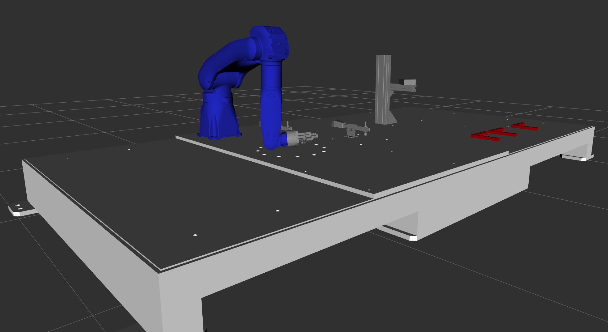
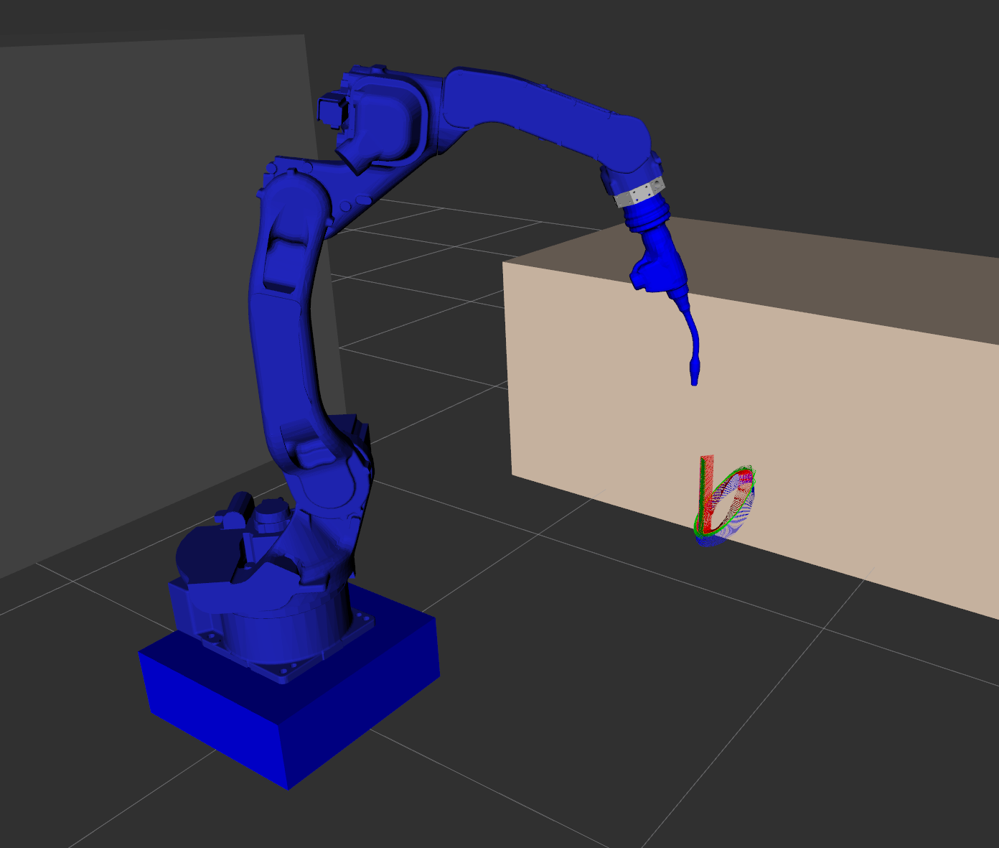

# Tools for training

## usage
 `vcs import < dep.repo` and you will have 3 workspace :

## content

- cogniman cell: 
    - a cell with a gpt7 with gazebo
    - `ros2 launch bringup launch1gz.launch.py ` will launch rviz, a RobotStatePublisher and Gazebo.

- Aspen cell :
    - a simple cell with a motoman MH1440 for welding.
    - toolpaths in `toolpath_4_tests` pkg

- planner_ws:
    - a package for the serveur (from tesseract ROS repo, but I wanted it separate from tesseract)
    - a package for the client
    - Of course this need for tesseract overlay !

I will add later a Wp with a gantry+6 axis